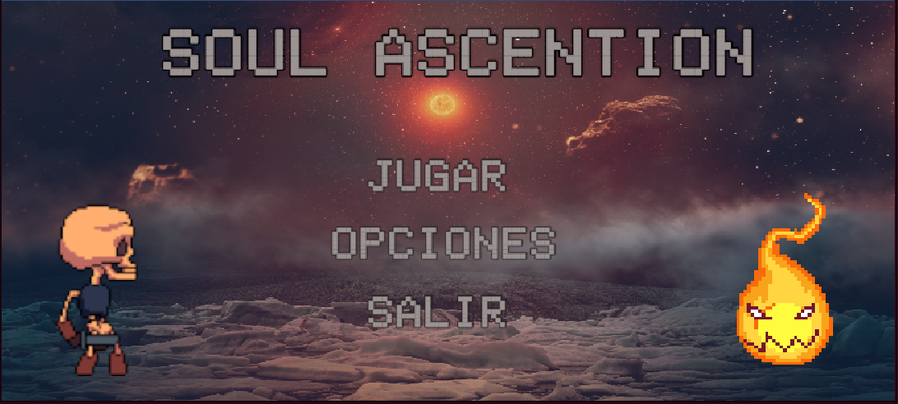
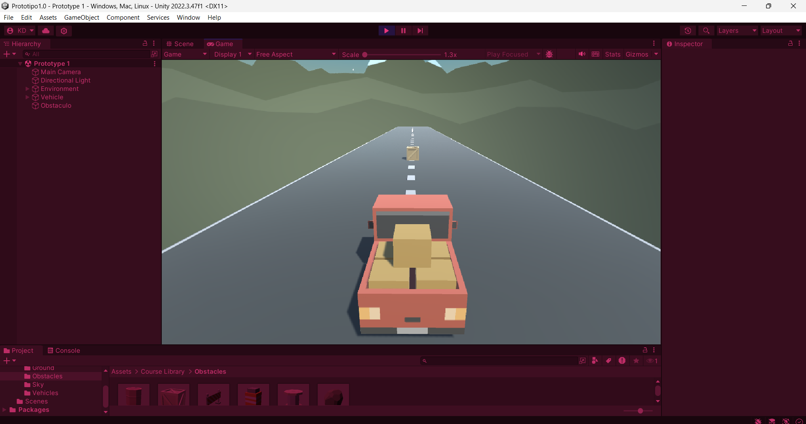
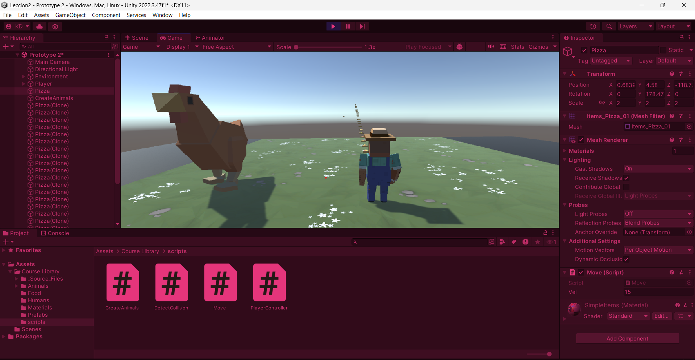
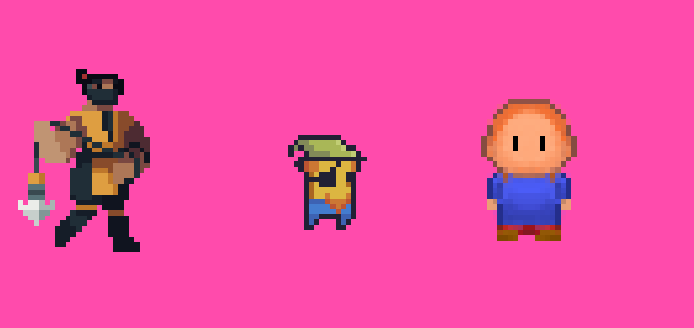
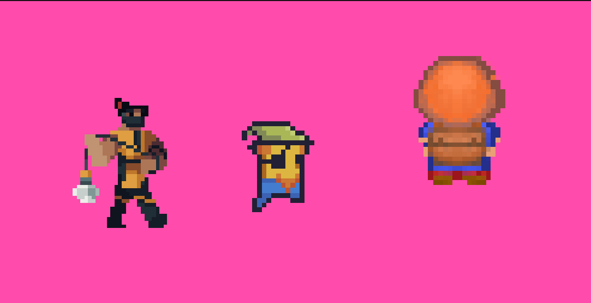

# Creación de Videojuegos 
Ejercicios realizados con unity en la asignatura 2D y 3D
 * 

     
   

## Repositorio del Videojuego 
 * [Soul Ascention](https://github.com/Karla038/SoulAscention.git)
   

     
   

## Código Fuente de las lecciones

* Lección 1
  * [Tutorial del vehículo 3D](https://github.com/Karla038/Prototipos_Unity/tree/main/Leccion1)
  * 

     
    

* Lección 2
  * [Tutorial del animales 3D](https://github.com/Karla038/Prototipos_Unity/tree/main/Leccion2)
  * [Documentación](https://docs.google.com/document/d/1JuJhyphxicNcgHQ73WWjiEP2lV-dKDKt/edit?usp=sharing&ouid=113058898750770286945&rtpof=true&sd=true)
  * 

     
    

* Lección 3 - Parte 1
  * [Tutorial caminando 2D](https://github.com/Karla038/Prototipos_Unity/tree/main/Leccion3_Parte1)
  * Parte 1
  * [Documentación](https://docs.google.com/document/d/1Vgrl-nLZZV7aT_3QMmzGKk2lLTS0eS8t/edit?usp=sharing&ouid=113058898750770286945&rtpof=true&sd=true)
  * 

     
    

* Lección 3 - Parte 2
   * [Player Animations 2D](https://github.com/Karla038/Prototipos_Unity/tree/main/Leccion3_Parte2)
   * [Documentación](https://docs.google.com/document/d/17Ao_xSa9-z6LEHslXuqHqhYgTy9pRj417BfmUndWzkc/edit?usp=sharing)
   * 

          
     

  
